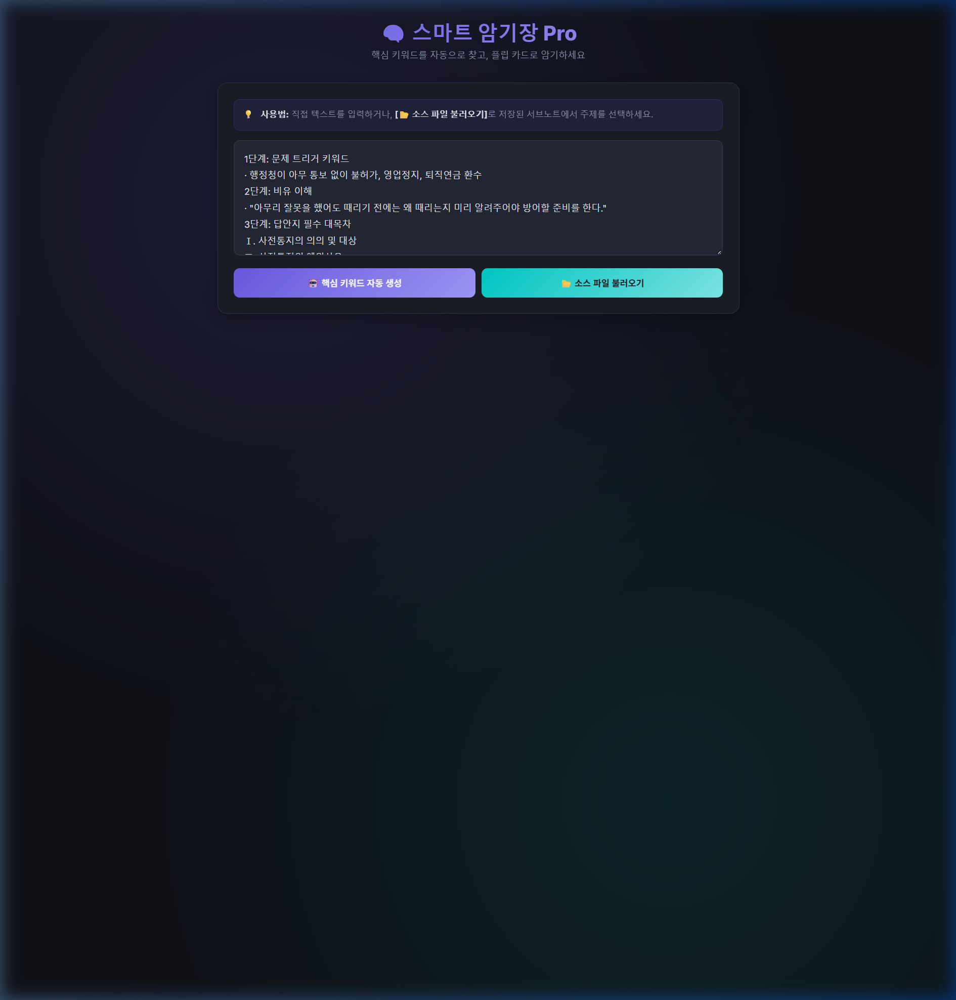

# 🧠 Smart Memorizer Pro (스마트 암기장 Pro)

> **클릭 한 번으로 핵심 키워드를 자동 추출하고, 플립 카드로 암기하는 오프라인 웹앱**

[한국어](#한국어) | [English](#english)



---

## 한국어

### ✨ 주요 기능

| 기능 | 설명 |
|------|------|
| 🤖 **핵심 키워드 자동 추출** | 텍스트를 분석하여 중요 키워드를 자동으로 감지 |
| 🎴 **플립 카드 암기** | 키워드를 블랭크 처리 → 클릭하면 정답 공개 (토글) |
| 📊 **4단계 난이도** | 입문(25%) → 기본(50%) → 심화(75%) → 극한(100%) |
| 📂 **소스 파일 불러오기** | Markdown 파일에서 주제별로 불러와 연습 |
| 💾 **오프라인 동작** | 서버 불필요, 브라우저만 있으면 OK |
| 🌙 **다크모드 UI** | 눈이 편한 프리미엄 다크 테마 |

### 🚀 시작하기

#### 방법 1: 그냥 열기 (가장 간단)
```
index.html 파일을 브라우저에서 직접 열기
```
> ⚠️ `file://` 프로토콜에서는 소스 파일 불러오기가 작동하지 않습니다.

#### 방법 2: 로컬 서버 (소스 파일 기능 포함)
```bash
# Python이 설치되어 있다면
python -m http.server 8765

# 또는 Node.js
npx serve .
```
브라우저에서 `http://localhost:8765` 접속

### 📂 소스 파일 추가하기

`sources/` 폴더에 Markdown (`.md`) 파일을 넣으면 자동으로 인식됩니다.

**1단계:** `sources/index.json`에 파일 등록
```json
[
  {"name": "내 공부 노트", "file": "my_notes.md"}
]
```

**2단계:** `sources/` 폴더에 `.md` 파일 추가
```markdown
## 주제 1: 첫 번째 주제
여기에 암기할 내용을 작성합니다.
핵심 개념과 정의를 포함하세요.

## 주제 2: 두 번째 주제
여기에 또 다른 내용을 작성합니다.
```

> 💡 `##` 제목으로 구분하면 주제별로 자동 파싱됩니다.

### 🎮 사용법

1. **텍스트 입력** 또는 **소스 파일에서 주제 선택**
2. `🤖 핵심 키워드 자동 생성` 클릭
3. 난이도 선택 (Level 1~4)
4. 보라색 블랭크를 클릭하여 정답 확인
5. 다시 클릭하면 블랭크로 복귀
6. 모든 키워드를 확인하면 다음 레벨 도전!

### 🛠 기술 스택

- **HTML/CSS/JavaScript** — 프레임워크 없음, 순수 바닐라
- **Google Fonts (Inter)** — 모던 타이포그래피
- **LocalStorage** — 마지막 입력 텍스트 자동 저장
- **Fetch API** — Markdown 소스 파일 로드

---

## English

### ✨ Features

- 🤖 **Auto Keyword Extraction** — Analyzes text and automatically detects key terms
- 🎴 **Flip Card Memorization** — Keywords hidden as blanks, click to reveal (toggle)
- 📊 **4 Difficulty Levels** — Easy (25%) → Normal (50%) → Hard (75%) → Extreme (100%)
- 📂 **Load Source Files** — Import Markdown files and practice by topic
- 💾 **Fully Offline** — No server required, works in any browser
- 🌙 **Dark Mode UI** — Premium dark theme, easy on the eyes

### 🚀 Getting Started

```bash
# Clone the repo
git clone https://github.com/infinimin/blank-memorizer.git
cd blank-memorizer

# Start a local server (for source file loading)
python -m http.server 8765
# or
npx serve .
```

Open `http://localhost:8765` in your browser.

### 📂 Adding Your Own Content

1. Add your `.md` files to the `sources/` folder
2. Register them in `sources/index.json`:
```json
[
  {"name": "My Study Notes", "file": "my_notes.md"}
]
```

Each `## Heading` in your Markdown becomes a selectable topic.

### 📄 License

This project is licensed under the [MIT License](LICENSE).

### 🤝 Contributing

Contributions are welcome! See [CONTRIBUTING.md](CONTRIBUTING.md) for guidelines.

---

**Made with ❤️ for learners everywhere**
